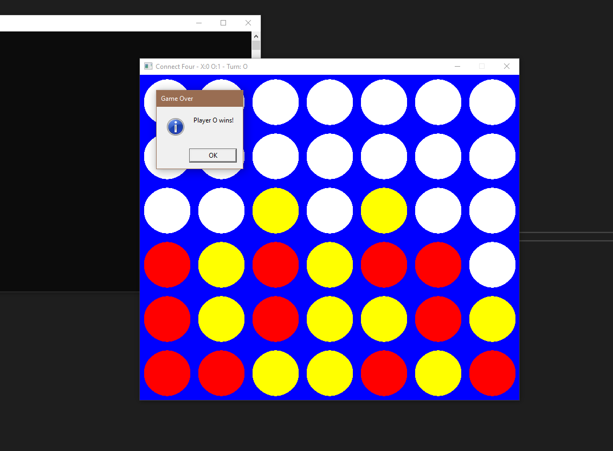

# Project 04 – [Connect 4]
 
## 🕹️ Description
 
This is a turn-based grid game written in C++ using SDL2. 
Players take turns placing pieces using the mouse to drop a piece in a column. Connect 4 in a row to win! The window title shows the current score (wins for X and O) and whose turn it is.
 
## 🎮 Controls
 
- Mouse Click to drop a piece! Then its the other person's turn and they click to drop a piece!
- Press `Esc` to exit at any time
 
## 🧪 Screenshot
 

 
## ✨ Extra Features
 
- Sound effects when placing and when someone wins
- Win counter in window title
- Title Screen

## Dependencies

- SDL2.lib, SDL2main.lib, SDL2_mixer.lib, SDL2_ttf.lib, SDL2_gfx.lib
- drop.wav
- win.wav
- arial.ttf, although this should be installed by default in windows. 